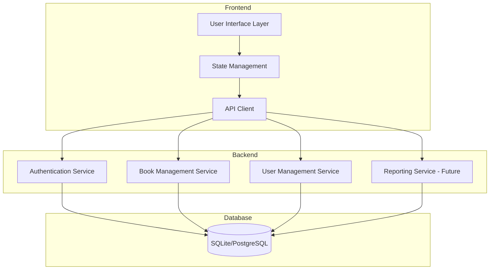

# Library Management System Architecture

## System Overview

The Library Management System follows a modern microservices architecture with clear separation of concerns. The system is divided into several key modules that communicate through well-defined interfaces.

## Architecture Diagram

## Module Descriptions

### 1. Frontend Layer

#### 1.1 User Interface Layer

- **Responsibility**: Handles all user interactions and presentation
- **Components**:
  - Pages (Login, Registration, Book Search, etc.)
  - Reusable UI components
  - Form handling
  - Navigation
- **Technologies**: React, Material-UI

#### 1.2 State Management

- **Responsibility**: Manages application state and data flow
- **Components**:
  - User session state
  - Book data state
  - UI state
- **Technologies**: React Context API (currently used for state management)

#### 1.3 API Client

- **Responsibility**: Handles communication with backend services
- **Components**:
  - API endpoints
  - Request/Response handling
  - Basic error handling
- **Technologies**: Fetch API (native browser API)

### 2. Backend Layer

#### 2.1 Authentication Service

- **Responsibility**: Handles user authentication and authorization
- **Components**:
  - User registration
  - Login/Logout
  - JWT token management
  - Role-based access control
- **Technologies**: FastAPI, JWT

#### 2.2 Book Management Service

- **Responsibility**: Manages book-related operations
- **Components**:
  - Book CRUD operations
  - Book search
  - Borrowing management
  - Return processing
- **Technologies**: FastAPI, SQLAlchemy

#### 2.3 User Management Service

- **Responsibility**: Handles user account management
- **Components**:
  - User profile management
  - Borrowing history
  - Account settings
- **Technologies**: FastAPI, SQLAlchemy

#### 2.4 Reporting Service (Future Implementation)

- **Responsibility**: Will handle generation of system reports and statistics
- **Planned Components**:
  - Borrowing statistics
  - User activity reports
  - Inventory reports
- **Future Technologies**: FastAPI, PostgreSQL (for analytics)

### 3. Database Layer

#### 3.1 Database

- **Responsibility**: Data persistence
- **Components**:
  - User data
  - Book data
  - Transaction records
  - System settings
- **Technologies**:
  - Currently: SQLite (development)
  - Planned: PostgreSQL (production)

## Communication Patterns

### 1. Frontend to Backend Communication

- RESTful API endpoints
- JSON data format
- JWT for authentication
- HTTP/HTTPS protocols

### 2. Backend to Database Communication

- ORM (SQLAlchemy)
- Basic data validation

## Security Measures

1. **Authentication**

   - JWT-based authentication
   - Password hashing
   - Session management

2. **Authorization**

   - Role-based access control
   - API endpoint protection
   - Resource-level permissions

3. **Data Protection**
   - Input validation
   - SQL injection prevention
   - XSS protection
   - CSRF protection

## Future Considerations

### 1. Database Migration

- Planned migration from SQLite to PostgreSQL
- Will require data migration strategy
- Will enable better scalability and concurrent access

### 2. Reporting Service

- Future implementation planned
- Will require additional database optimizations
- Will integrate with PostgreSQL for analytics

### 3. State Management

- Currently using React Context API
- May consider Redux for more complex state management if needed

### 4. Error Handling Improvements

- Implement more comprehensive error handling
- Add error boundaries in React components
- Enhance error logging and reporting
- Add global error handling middleware

### 5. Database Optimizations

- Add connection pooling
- Implement transaction management
- Add database monitoring
- Optimize query performance

## Error Handling

1. **Frontend Error Handling**

   - User-friendly error messages
   - Error boundary implementation
   - Network error handling

2. **Backend Error Handling**
   - Global error handling
   - Custom exception classes
   - Error logging
   - Error reporting

## Monitoring and Logging

1. **System Monitoring**

   - Service health checks
   - Performance metrics
   - Resource utilization

2. **Logging**
   - Application logs
   - Error logs
   - Audit logs
   - User activity logs
