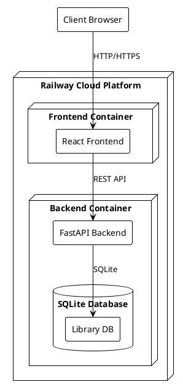

# Deployment Diagram

This document describes the deployment architecture of the Library Web Application.

## Deployment Diagram in PlantUML

## Deployment Components

1. **Client Browser**

   - End users access the application through their web browsers
   - Communicates with the frontend via HTTP/HTTPS

2. **Frontend Container (Railway)**

   - Hosts the React application
   - Serves static files and handles client-side routing
   - Communicates with the backend via REST API

3. **Backend Container (Railway)**

   - FastAPI server running the Python application
   - Handles business logic and API requests
   - Contains the SQLite database file
   - Database file is persisted through Railway's volume system

## Deployment Flow

1. Users access the application through their web browsers
2. The frontend container serves the React application
3. Frontend makes API calls to the backend container
4. Backend processes requests and interacts with the local SQLite database
5. Database file is persisted between deployments

## Infrastructure Details

- All components are deployed on Railway's cloud platform
- Two containers: Frontend and Backend
- Railway handles container orchestration and scaling
- SQLite database file is stored within the backend container and persisted through Railway's volume system
- HTTPS is enabled for secure communication
